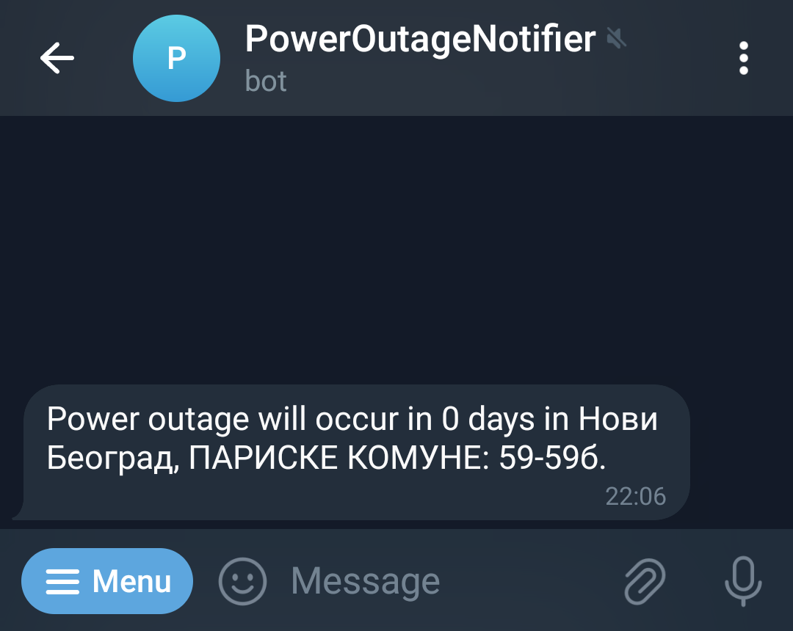

# Power Outage Notifier

Power Outage Notifier is a Telegram bot designed to keep you informed about various events related to power and water outages in Belgrade, Serbia. This bot provides real-time notifications for planned power outages, planned water outages, and unplanned water outages. Additionally, it has a work-in-progress feature to notify users about parking fines in Belgrade.

> NOTE: Power Outage Notifier is a Work-in-Progress and still has some rough edges.



# Introduction

If you've ever found yourself wishing you had advance notice of power or water outages in your area, Power Outage Notifier is here to provide you with the timely information you need. Imagine being able to plan your day, secure your appliances, or make necessary arrangements well ahead of scheduled power interruptions. With our Telegram bot, you'll receive instant alerts about planned and unplanned outages, allowing you to stay informed and take proactive measures to minimize disruptions.

# Features
### 1. ⚡ Planned Power Outage Notifications
Receive timely alerts whenever there is a scheduled power outage in Belgrade. Stay informed about the affected municipalities and streets well in advance.

### 2. 💧 Planned Water Outage Notifications
Get notifications for planned water outages in Belgrade. Know the details of the affected areas and streets to plan accordingly.

### 3. 💧 Unplanned Water Outage Notifications
Stay updated on unplanned water outages happening in Belgrade. Receive immediate alerts with information about the affected municipalities and streets.

### 4. 🅿️ Parking Fine Notifications (Coming Soon)
In the future, Power Outage Notifier will also provide notifications for received parking fines in Belgrade, helping you stay on top of any fines issued.

# Usage

1. Send a `/register` message to https://t.me/PowerOutageNotifierSrbijaBot
2. Answer the prompts with honesty and integrity
3. Profit??

## Hosting your own

If you want to host your own using Docker, getting started is as simple as using the following docker-compose:

> See [docker-compose.yml](./docker-compose.yml) for a docker-compose file.

#### How to upgrade or deploy:
```
docker build -t poweroutagenotifier .
docker tag poweroutagenotifier belgradebc/poweroutagenotifier
docker save -o poweroutagenotifier.tar belgradebc/poweroutagenotifier
```

1. Upload the tar image to device.
2. Load the image into the docker container manager.
3. Run the [docker-compose.yml](./docker-compose.yml)

# Contributing

Please see the [CONTRIBUTING.md](CONTRIBUTING.md) for instructions for how to develop and contribute to the codebase.

# Authors

Aleksa Jankovic

# Licenses

- MIT

# Sponsors

If you found Power Outage Notifier valuable, please consider [supporting my work](https://github.com/sponsors/ak800i/)
